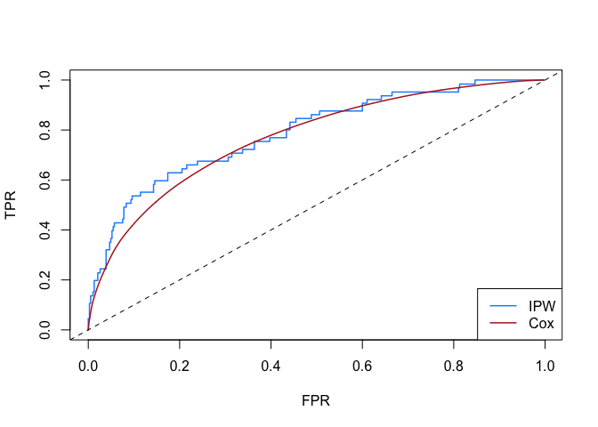

survAccuracyMeasures
=============================================

This R package computes non-parametric (NP) and semi-parametric (SP) estimates of common accuracy measures for risk prediction markers from survival data. It consists of the function `survAM.estimate` which estimates the *AUC*, *TPR( c )*, *FPR( c )*, *PPV( c )*, and *NPV( c )* for for a specific prediction time and marker cutoff value c.  

 NP estimates are calculated using inverse probability weighting, while SP estimates are based on a Cox proportional hazards model. For detailed information regarding estimation methods, see references below. 

Standard errors for estimates can be obtained by bootstrapping. Asymptotic standard error calculations are also available for semi-parametric Cox estimates. Confidence intervals using a normal approximation are computed.

## Tutorial


```r
#install the package from github
# download the package from github
if (!require("devtools")) install.packages("devtools")
devtools::install_github("mdbrown/survAccuracyMeasures")
```


```r
library(survAccuracyMeasures)
```

```
## Loading required package: survival
```

```
## Loading required package: splines
```

```r
set.seed(112233)
#simulated data for illustration
data(SimData)
head(SimData)
```

```
##    survTime status           Y
## 1 0.1196943      1  1.49309894
## 2 1.0231233      0 -0.73259981
## 3 0.8281849      0 -0.50211426
## 4 2.0874756      1  0.65757501
## 5 4.6826824      1  1.57805834
## 6 0.3000964      1  0.02419083
```


Estimate all measures, using the bootstrap to estimate standard errors. First we obtain non-parametric estimates using inverse probablity weighting:


```r
#non-parametric estimates with bootstrap standard errrors
##in practice 'bootstraps' should be set to a larger value
survAM.estimate(time =survTime,
                event = status,
                marker = Y,
                data = SimData,
                estimation.method = "IPW",
                se.method = "bootstrap",
                predict.time = 1,
                threshold = 0.5,
                threshold.type = "marker", 
                bootstraps = 50)
```

```
## 
## Non-Parametric IPW estimates of accuracy measures:
##    (SE's calculated using the bootstrap)
## 
##         estimate     se      lower 0.95  upper 0.95
## AUC        0.786     0.032         0.716       0.842 
## TPR(c)     0.645     0.057         0.527       0.747 
## FPR(c)     0.213     0.024         0.170       0.263 
## PPV(c)     0.326     0.042         0.249       0.414 
## NPV(c)     0.933     0.012         0.905       0.953 
## 
## marker threshold: c = 0.5
## 
## Information for ROC curve found in x$roc.
```

```r
survAM.estimate(time =survTime, 
                event = status, 
                marker = Y,
                data = SimData, 
                estimation.method = "IPW",    
                se.method = "asymptotic",
                predict.time = 1, 
                threshold = 0.5, 
                threshold.type = 'marker' )
```

```
## 
## Non-Parametric IPW estimates of accuracy measures:
##    (SE's calculated using asymptotic variance)
## 
##         estimate     se      lower 0.95  upper 0.95
## AUC        0.786     0.031         0.718       0.841 
## TPR(c)     0.645     0.059         0.522       0.751 
## FPR(c)     0.213     0.021         0.175       0.257 
## PPV(c)     0.326     0.042         0.249       0.414 
## NPV(c)     0.933     0.014         0.900       0.955 
## 
## marker threshold: c = 0.5
## 
## Information for ROC curve found in x$roc.
```

Alternatively, we can calculate semi-parametric estimates based on a Cox proportional hazards model:


```r
#semi-parametric estimates assuming a cox model
##in practice 'bootstraps' should be set to a larger value
survAM.estimate(time =survTime, 
                event = status, 
                marker = Y,
                data = SimData, 
                estimation.method = "Cox",
                se.method = "bootstrap",
                predict.time = 1, 
                threshold = 0, 
                threshold.type = 'marker',
                bootstraps = 50)
```

```
## 
## Semi-Parametric Cox estimates of accuracy measures:
##    (SE's calculated using the bootstrap)
## 
##         estimate     se      lower 0.95  upper 0.95
## coef       1.010     0.074         0.864       1.156 
## AUC        0.768     0.017         0.733       0.801 
## TPR(c)     0.788     0.028         0.727       0.838 
## FPR(c)     0.412     0.023         0.369       0.458 
## PPV(c)     0.241     0.027         0.192       0.298 
## NPV(c)     0.943     0.007         0.927       0.956 
## 
## marker threshold: c = 0
## 
## Information for ROC curve found in x$roc.
```

```r
## here we calculate the SE's based on the asymptotic properties of the Cox estimator.  
survAM.estimate(time =survTime, 
                event = status, 
                marker = Y,
                data = SimData, 
                estimation.method = "Cox",    
                se.method = "asymptotic",
                predict.time = 1, 
                threshold =  0.5, 
                threshold.type = 'marker')
```

```
## 
## Semi-Parametric Cox estimates of accuracy measures:
##    (SE's calculated using asymptotic variance)
## 
##         estimate     se      lower 0.95  upper 0.95
## coef       1.010     0.085         0.842       1.177 
## AUC        0.768     0.020         0.727       0.805 
## TPR(c)     0.602     0.037         0.527       0.672 
## FPR(c)     0.212     0.019         0.178       0.251 
## PPV(c)     0.320     0.038         0.252       0.398 
## NPV(c)     0.922     0.010         0.900       0.940 
## 
## marker threshold: c = 0.5
## 
## Information for ROC curve found in x$roc.
```

The threshold can also be selected by fixing the FPR, TPR, PPV, or NPV using the `threshold.type` argument. Below we select the threshold such that the FPR is fixed to 0.05. 


```r
#non-parametric estimates with bootstrap standard errrors
##in practice 'bootstraps' should be set to a larger value
survAM.estimate(time =survTime, 
                event = status, 
                marker = Y,
                data = SimData, 
                estimation.method = "IPW",    
                se.method = "bootstrap",
                predict.time = 1, 
                threshold =  .05, 
                threshold.type = 'FPR', 
                bootstraps = 50)
```

```
## 
## Non-Parametric IPW estimates of accuracy measures:
##    (SE's calculated using the bootstrap)
## 
##         estimate     se      lower 0.95  upper 0.95
## AUC        0.786     0.035         0.710       0.846 
## TPR(c)     0.366     0.082         0.224       0.536 
## FPR(c)     0.049     0.002         0.046       0.053 
## PPV(c)     0.543     0.067         0.412       0.667 
## NPV(c)     0.904     0.017         0.865       0.932 
## 
## threshold c: FPR(c) = 0.05
## 
## Information for ROC curve found in x$roc.
```


## Plot ROC curves 

Information to plot an ROC curve can be accessed 


```r
est.ipw <- survAM.estimate(time =survTime,
                event = status,
                marker = Y,
                data = SimData,
                estimation.method = "IPW",
                se.method = "asymptotic",
                predict.time = 1,
                threshold = 0.5,
                threshold.type = "marker")
#information for roc curve 
head(est.ipw$roc) 
```

```
##      marker       FPR TPR       PPV NPV
## 1 -2.746427 0.9974026   1 0.1382544   1
## 2 -2.698166 0.9948052   1 0.1385654   1
## 3 -2.432131 0.9922078   1 0.1388777   1
## 4 -2.407929 0.9896104   1 0.1391915   1
## 5 -2.407329 0.9870130   1 0.1395067   1
## 6 -2.404262 0.9844156   1 0.1398233   1
```

```r
est.cox <- survAM.estimate(time =survTime,
                event = status,
                marker = Y,
                data = SimData,
                estimation.method = "Cox",
                se.method = "asymptotic",
                predict.time = 1,
                threshold = 0.5,
                threshold.type = "marker")

#information for roc curve 
head(est.cox$roc) 
```

```
##      marker        risk marker.percentile       FPR       TPR       PPV
## 1 -2.746427 0.006896890             0.002 0.9976833 0.9999033 0.1429297
## 2 -2.698166 0.007240099             0.004 0.9953674 0.9998018 0.1432022
## 3 -2.432131 0.009460958             0.006 0.9930567 0.9996692 0.1434713
## 4 -2.407929 0.009693904             0.008 0.9907465 0.9995333 0.1437410
## 5 -2.407329 0.009699752             0.010 0.9884363 0.9993973 0.1440118
## 6 -2.404262 0.009729694             0.012 0.9861262 0.9992609 0.1442836
##         NPV
## 1 0.9931031
## 2 0.9929315
## 3 0.9921340
## 4 0.9916770
## 5 0.9914017
## 6 0.9912131
```

```r
plot(est.ipw$roc$FPR, est.ipw$roc$TPR, type = "l", 
     xlab = "FPR", ylab = "TPR", 
     col = "dodgerblue", lwd = 1.5)
lines(est.cox$roc$FPR, est.cox$roc$TPR, col = "firebrick", lwd = 1.5)
abline(0,1, lty = 2)

legend("bottomright", legend = c("IPW", "Cox"), col = c("dodgerblue", "firebrick"), lwd = c(1.5, 1.5), lty = c(1,1))
```

<!-- -->


For more information see `?survAM.estimate`. 


### References
Liu D, Cai T, Zheng Y. Evaluating the predictive value of biomarkers with stratified case-cohort design. *Biometrics* 2012, 4: 1219-1227.

Pepe MS, Zheng Y, Jin Y. Evaluating the ROC performance of markers for future events. *Lifetime Data Analysis.* 2008, 14: 86-113.

Zheng Y, Cai T, Pepe MS, Levy, W. Time-dependent predictive values of prognostic biomarkers with failure time outcome. *JASA* 2008, 103: 362-368.


